# Architecture

EvoLoRA separates the agent's choices from the system's authority. MiniMax can propose evals, examples, and hyperparameters, but Python validates the plan, locks evals, runs training, scores results, persists records, and decides when user approval is required.

```mermaid
flowchart LR
    User["User goal and sample count"] --> TUI["Textual TUI / Typer CLI"]
    TUI --> Orchestrator["Bounded orchestrator"]
    Orchestrator --> EvalLock["Locked eval set + hash"]
    Orchestrator --> MiniMax["MiniMax planner"]
    MiniMax --> Tools["Bounded tools: create_evals, add_training_examples, start_training_model"]
    Tools --> Validator["Python validation"]
    Validator --> Training["Mock / Unsloth / remote training backend"]
    Training --> RemoteConfig["SFTP config push to GPU VM"]
    RemoteConfig --> VM["GPU VM trains and writes results.json"]
    VM --> RemoteRunner["RemoteModelRunner pulls results"]
    Training --> LocalRunner["MockModelRunner fallback"]
    RemoteRunner --> Scoring["Objective scorer"]
    LocalRunner --> Scoring
    Scoring --> Judge["DigitalOcean judge or heuristic fallback"]
    Judge --> Advisor["MiniMax retrain advisor or heuristic fallback"]
    Advisor --> Approval["User approval prompt when retrain is recommended"]
    Scoring --> Store["MongoDB Atlas or in-memory store"]
    Judge --> Store
    Store --> Best["Best adapter/run record"]
```



## Safety Boundaries

- Expected eval answers stay local. Remote config pushes only eval prompts plus the eval-set hash.
- Missing SSH config causes dry-run config push and mock runner fallback.
- Missing MiniMax or DigitalOcean keys causes labeled heuristic fallback.
- Missing MongoDB causes in-memory persistence.
- `.env`, generated adapters, checkpoints, and runtime artifacts stay ignored.

## Remote VM Contract

EvoLoRA writes config JSON to `REMOTE_CONFIG_PATH`, defaulting to `~/evolora/config.json`.

The config contains:

- `run_id`
- `iteration`
- `base_model_id`
- chosen LoRA hyperparameters
- validated training examples
- `eval_prompts`
- eval-set hash
- `remote_results_path`

The VM writes `REMOTE_RESULTS_PATH`, defaulting to `~/evolora/results.json`, as:

```json
{
  "sample-001": "{\"top_customer\":\"Alice\", ...}",
  "sample-002": "{\"top_customer\":\"Bob\", ...}"
}
```

EvoLoRA pulls that file and scores responses locally against the locked expected answers.
